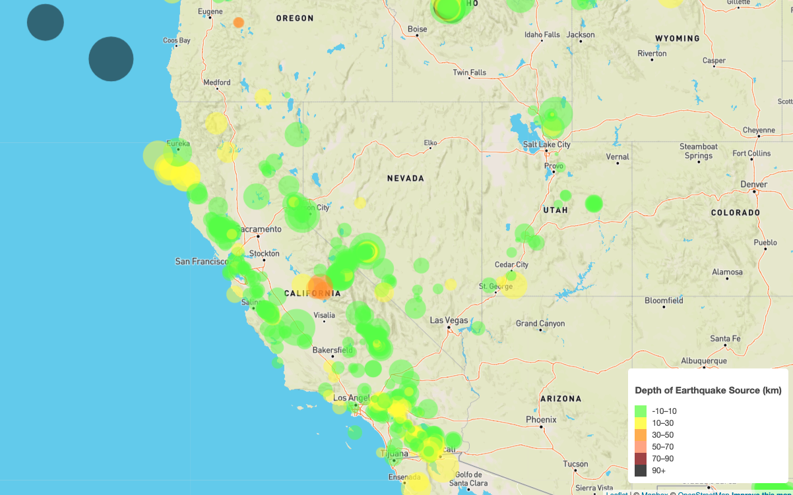

# leaflet-challenge

This repository creates a map with Leaflet that plots earthquake data from the last 7 days using a geojson from USGS.

The data markers reflect the magnitude of the earthquake by their size and and depth of the earth quake by color. Earthquakes with higher magnitudes  appear larger and earthquakes with greater depth appear darker in color.

Each marker includes a popup that provides additional information about the earthquake when the marker is clicked.

The map contains a legend that explains how the marker colors correspond to the earthquake depth.
